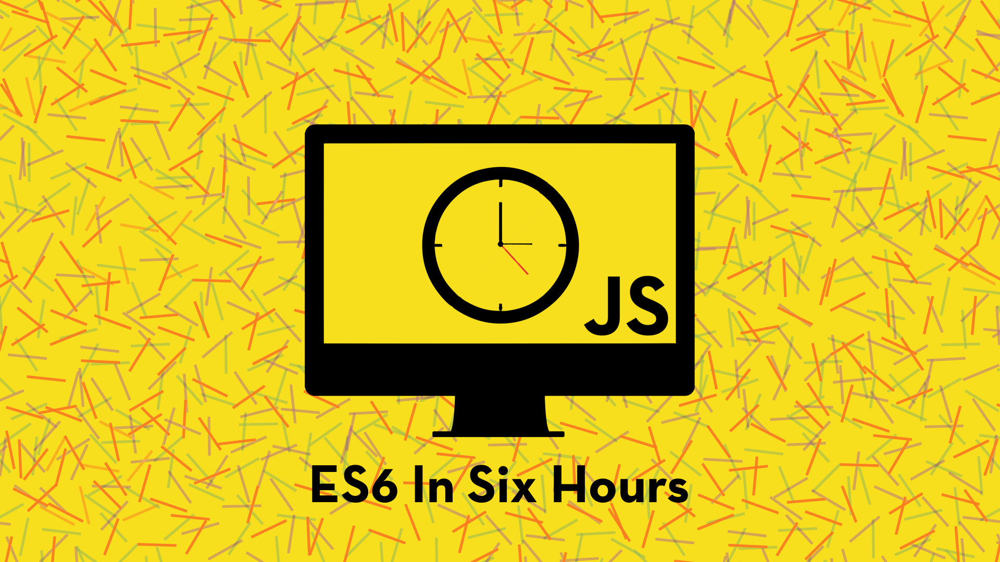

## What & Why

> **If you haven’t learned ES6 yet, the time is now. - [Eric Elliott](https://twitter.com/_ericelliott)**

ES6 also know as ECMAScript 6 or ECMAScript 2015 is a fun and interesting addition to JavaScript. There's lots of ways to learn the content, here's my take on the topics. It's meant to have a low barrier of entry and to be consumed in six one hour sessions.

## ES6 Topics Covered
- [Let](./src/01-a-let.md) and [Const](./src/01-b-const.md)
- [Arrow Functions and Lexical This](./src/02-arrow-functions-and-lexical-this.md)
- [Template Literals](./src/03-template-literals.md)
- [Destructuring](./src/04-destructuring.md)
- [Default](./src/05-a-default.md) + [Rest](./src/05-b-rest.md) + [Spread](./src/05-c-spread.md)
- [Iterators](./src/06-a-iterators.md) + [For..Of](./src/06-b-for-of.md)
- [Generators](./src/07-generators.md)
- [Promises](./src/08-promises.md)

## Prerequisite
Knowledge of JavaScript (ES5) is recommended.

## Setup
Setup and use requires
[Git](https://git-scm.com/),
[Node JS](https://nodejs.org/en/),
and a text editor such as
[Brackets](http://brackets.io/).

If you're on a Mac, I'd suggest using
[Homebrew](https://brew.sh/) for installing the
required software listed in Setup.

## Video Tutorials

## Continued Reading
- [You Don't Know JS](https://github.com/getify/You-Dont-Know-JS)
- [Eric Elliott's How to Learn ES6](https://medium.com/javascript-scene/how-to-learn-es6-47d9a1ac2620)

## Many Thanks
Inspired and some material from other awesome contributors to Open Source from around the Internet.

Made with :heart:, JavaScript, and GitHub.
